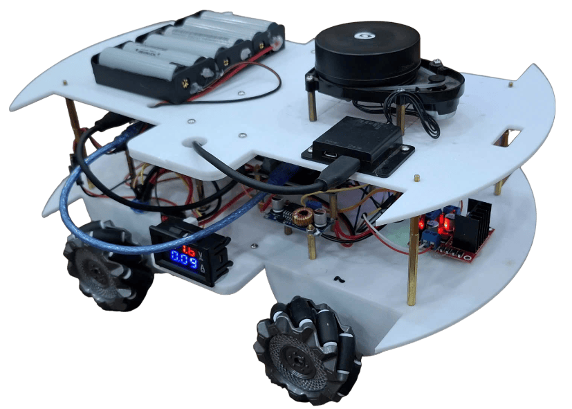
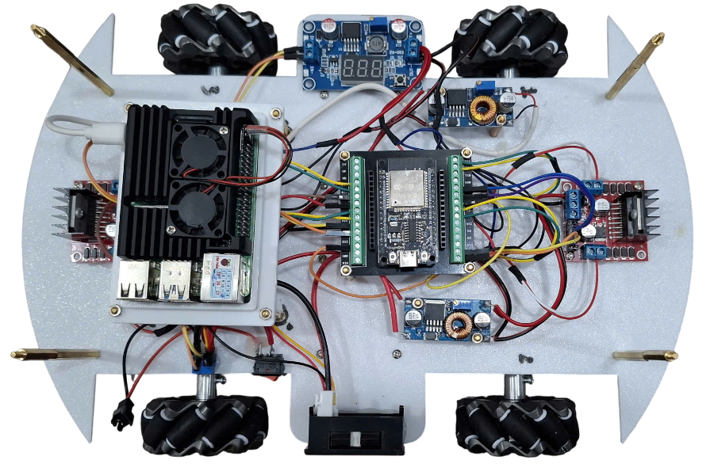
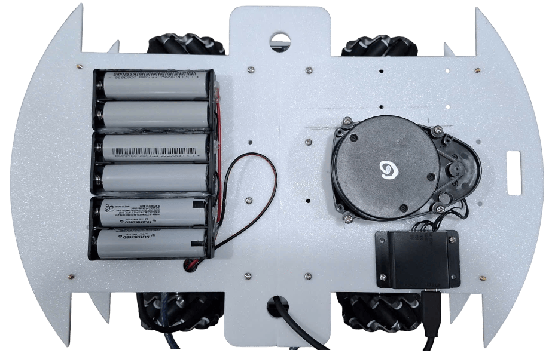
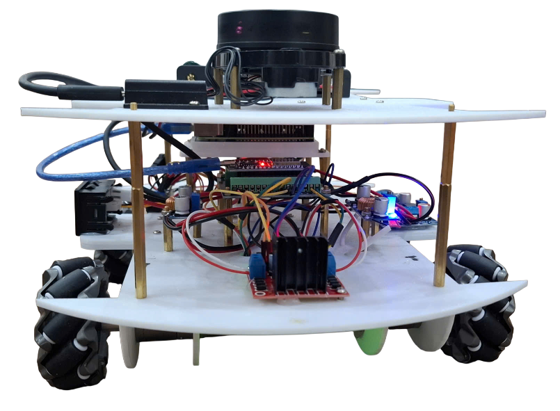
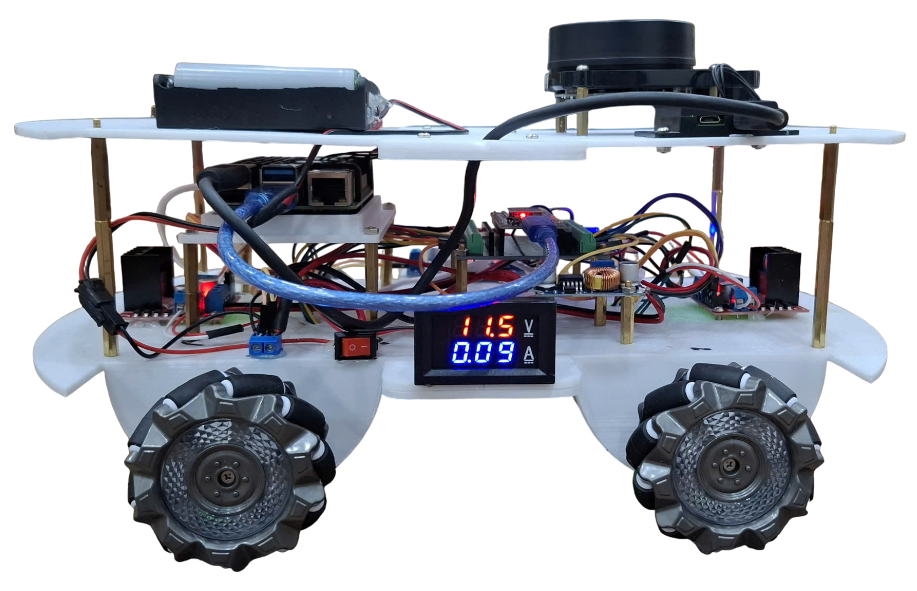

# Autonomous Mecanum-Wheel Robot

## 1. Introduction
This project focuses on designing and implementing an **autonomous mobile robot** using **Mecanum wheels**, enabling omnidirectional movement suitable for warehouses and narrow environments.  
The system integrates:  
- **ESP32** – motor control and low-level communication  
- **Raspberry Pi 4** – high-level processing, SLAM, and navigation algorithms  
- **YDLIDAR X3 Pro** – real-time environment scanning and mapping  

The robot is capable of **localization, mapping (SLAM), obstacle avoidance**, and **path planning**, making it applicable in industrial and service environments.

---

## 2. Hardware Requirements
- **ESP32 DevKit** (motor driver & encoder interface)  
- **Raspberry Pi 4 (4GB or 8GB RAM)**  
- **YDLIDAR X3 Pro** (LiDAR sensor)  
- **GA25 DC Motors with Encoders** (x4, with Mecanum wheels)  
- **Motor Drivers (L298N or equivalent, 4 channels)**  
- **12V Battery Pack**  
- **Frame & chassis with Mecanum wheels**
<!-- Row 1: 1 image -->
<p align="center">
  
</p>

<!-- Row 2: 2 images -->
<p align="center">
  
  
</p>

<!-- Row 3: 2 images -->
<p align="center">
  
  
</p>

---

## 3. Software Requirements
- **ROS 2 Foxy / Humble** (on Raspberry Pi 4)  
- **Ubuntu 20.04 / 22.04**  
- **ESP-IDF or Arduino IDE** (to program ESP32)  
- **SLAM Cartographer**  
- **Nav2 (Navigation2)** for path planning and obstacle avoidance  
- **YDLIDAR SDK**  

---

## 4. Installation & Setup

### ESP32 (Motor Control)
1. Install [Arduino IDE](https://www.arduino.cc/en/software) or ESP-IDF.  
2. Flash motor control firmware (`esp32_motor_control.ino`).  
3. Connect encoders and motor drivers to ESP32.  

### Raspberry Pi 4
1. Install Ubuntu and ROS 2.  
2. Install LiDAR SDK:
3. Run the required file
```bash
ros2 launch motor_control kinematic.launch.py
ros2 launch motor_control serial_brigde.launch.py
ros2 launch ydlidar_ros2_driver ydlidar_launch.py
```

### Laptop
1. Install Ubuntu and ROS 2.
 ```bash
ros2 launch mecanum_joy mecanum_joy.launch.py
ros2 launch rf2o_laser_odometry rf2o_laser_odometry
ros2 launch robot_mapping cartographer.launch.py
ros2 launch robot_navigation navigation.launch.py
```
## Result
- Mapping: https://youtu.be/SoL5KJzKNMY
- Navigation: https://youtu.be/H2pn3pVcRK0
  
## Author
- Name: BUI QUOC DOANH
- GitHub: [is-buiquocdoanh](https://github.com/is-buiquocdoanh)
- Email: doanh762003@gmail.com
